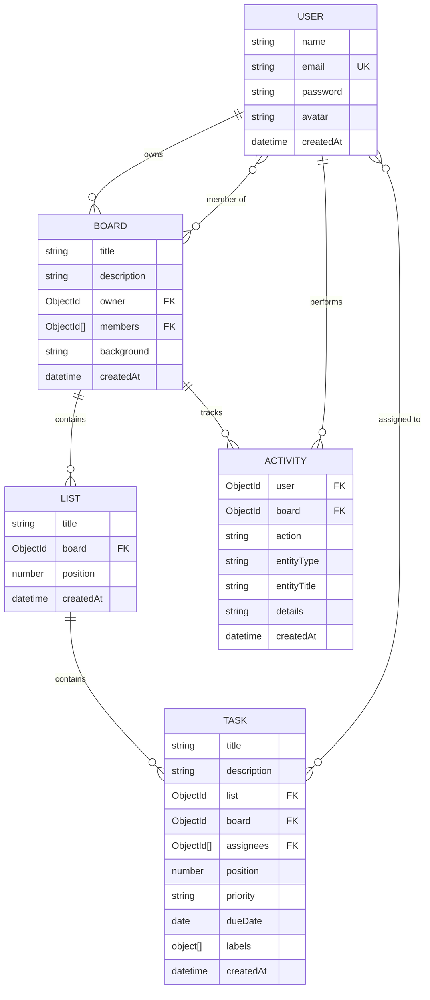

# Architecture Documentation

## Frontend Architecture

### Framework & Tooling
- **React 18** with **Vite** for fast HMR and optimized builds
- **React Router v6** for client-side SPA routing with private/public route guards

### State Management
- **AuthContext** (Context + useReducer) — manages user session, JWT token lifecycle, login/signup/logout actions with localStorage persistence
- **SocketContext** — manages Socket.IO connection lifecycle, board room join/leave, and exposes connection state
- **Local component state** — individual pages manage board/list/task data via `useState` + API fetches
- Real-time events from Socket.IO dispatch into local state updaters, so no full refetch is needed on remote changes

### Component Hierarchy
```
App
├── AuthProvider (Context)
│   └── SocketProvider (Context)
│       └── Routes
│           ├── LoginPage (public)
│           ├── SignupPage (public)
│           ├── DashboardPage (private)
│           │   └── CreateBoardModal
│           └── BoardPage (private)
│               ├── Navbar
│               ├── KanbanBoard (DragDropContext)
│               │   ├── KanbanList[] (Droppable)
│               │   │   └── TaskCard[] (Draggable)
│               │   └── AddList
│               ├── TaskModal
│               ├── ActivitySidebar
│               └── AddMemberModal
```

### Drag & Drop
Uses **@hello-pangea/dnd** (maintained fork of react-beautiful-dnd):
1. `DragDropContext` wraps the kanban container
2. Each list is a `Droppable` with `droppableId = list._id`
3. Each task is a `Draggable` with `draggableId = task._id`
4. On `onDragEnd`, the UI updates optimistically, then calls `PUT /api/tasks/reorder`
5. On API failure, the board refetches to revert

---

## Backend Architecture

### Framework
- **Express.js** with modular MVC pattern (routes → controllers → models)

### Authentication Flow
1. **Signup**: Hash password with bcrypt → save user → return JWT
2. **Login**: Find user → compare hash → return JWT
3. **Auth middleware**: Extract Bearer token → verify JWT → attach `req.user`
4. Socket.IO connections also authenticate via JWT in `handshake.auth.token`

### API Design
- RESTful endpoints grouped by resource (`/api/auth`, `/api/boards`, `/api/lists`, `/api/tasks`)
- Request validation via **express-validator**
- Consistent error responses with status codes and messages
- Pagination on list endpoints (`page`, `limit` query params)

### Real-Time Sync Strategy (Socket.IO)
```
Client A                    Server                    Client B
   |                          |                          |
   |-- POST /api/tasks ------>|                          |
   |                          |-- Save to MongoDB        |
   |                          |-- Activity.create()      |
   |                          |-- io.to(board).emit() -->|
   |<-- HTTP 201 ------------|                          |
   |                          |<-- socket event -------->|
   |                          |                          |
```

1. All CRUD operations go through REST APIs
2. After successful DB mutation, the controller emits a Socket.IO event to the board room
3. Clients listen for events and update local state without needing to refetch
4. Board rooms: clients join `board:{boardId}` on mount and leave on unmount

---

## Database Schema

### ER Diagram


### Indexes
| Collection | Index | Purpose |
|---|---|---|
| User | `email` (unique) | Fast login lookups |
| Board | `members`, `owner` | Filter boards by membership |
| List | `board + position` | Ordered list retrieval |
| Task | `board + list + position` | Ordered task retrieval |
| Task | `title + description` (text) | Full-text search |
| Task | `assignees` | Filter tasks by assignee |
| Activity | `board + createdAt` (desc) | Reverse chronological activity log |

---

## Scalability Considerations

1. **Horizontal Scaling** — Stateless JWT auth allows adding more API servers behind a load balancer
2. **Socket.IO Adapter** — Use `@socket.io/redis-adapter` to share events across multiple server instances
3. **Database** — Add read replicas for query-heavy operations; shard by board ID for large datasets
4. **Caching** — Add Redis cache for frequently accessed boards and user sessions
5. **Rate Limiting** — Add `express-rate-limit` middleware to prevent abuse
6. **CDN** — Serve static frontend assets from a CDN (CloudFront, Cloudflare)
7. **Message Queue** — For high-volume activity logging, use a queue (RabbitMQ/SQS) instead of synchronous DB writes
